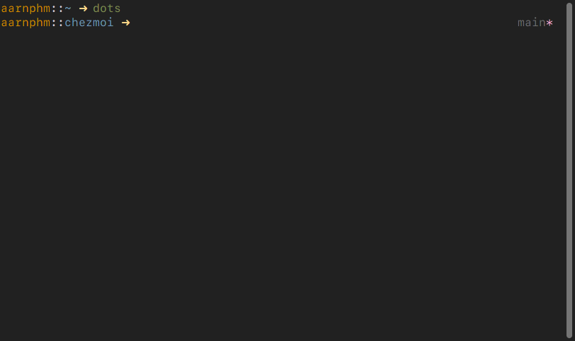

<h1 align="center">simple</h1>

<p align="center"><i>a one line ZSH prompt that doesn't suck</i></p>



a one line fork from [pure](https://github.com/sindresorhus/pure)

### Why?

I get tired of two line prompt but love pure

### Installation

1. Clone this repo to `$ZDOTDIR`, here we assume it is `$HOME/.zsh`

```sh
    mkdir -p ${ZDOTDIR:-$HOME/.zsh}
    git clone git@github.com:aarnphm/simple.git $ZDOTDIR/simple
```

2. add `fpath+=$ZDOTDIR/simple` in `$ZDOTDIR/.zshrc`

3. Initialize prompt system and choose `simple`:

```sh
    autoload -Uz promptinit && promptinit
    prompt simple
```
